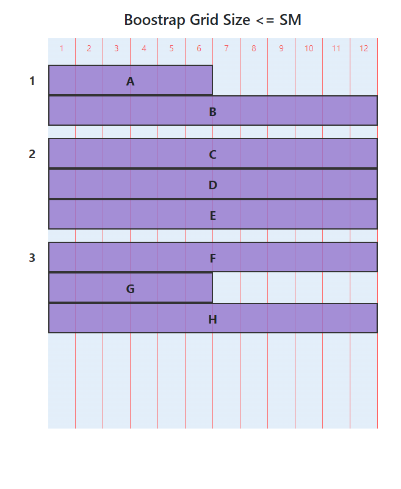
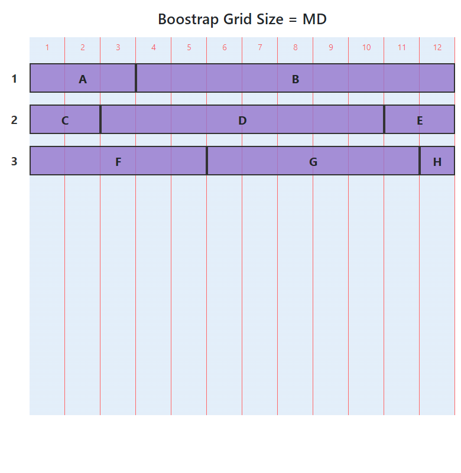
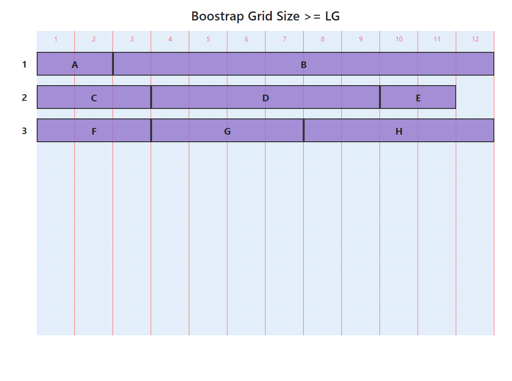

# Exercice: CSS Bootstrap

Ouvrir le projet dans [codesanbox.io](https://codesandbox.io/s/github/bfritscher/cours-html-exercices/tree/master/CSS_Bootstrap_Grid)

 Compléter le ficher index.html pour obtenir une grille responsive avec Bootstrap.

- Utiliser les exemples de la documentation Bootstrap.

Le résultat doit être une grille qui adapte ses colonnes au différents tailles d'écran. 

## Résultat attendu
### XS + Small (sm)

### Medium (md)

### Large (lg)

